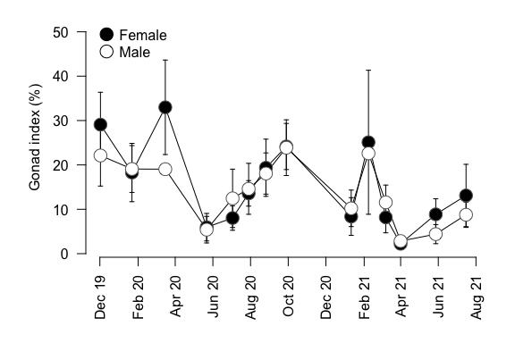
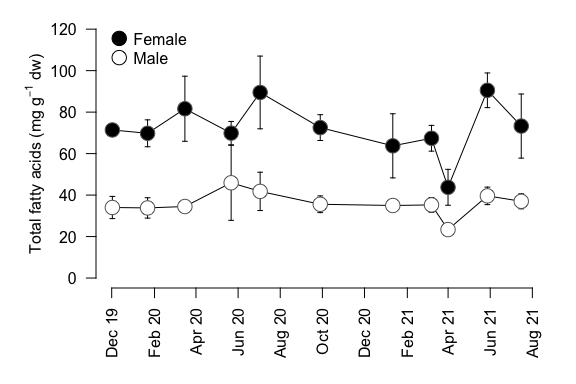
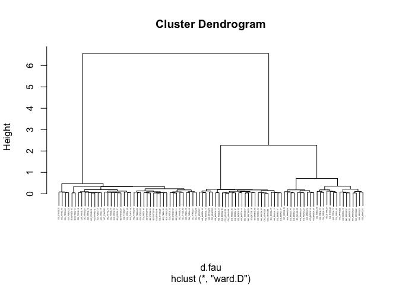
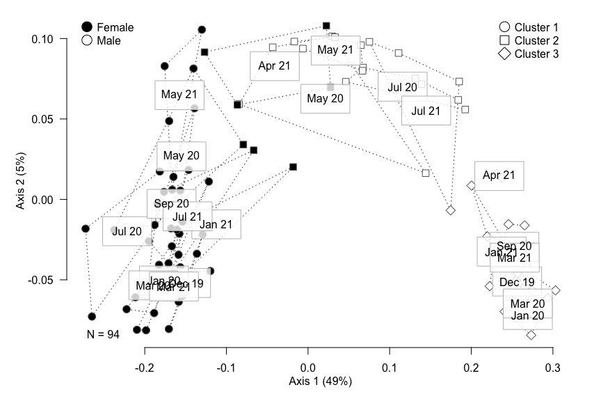
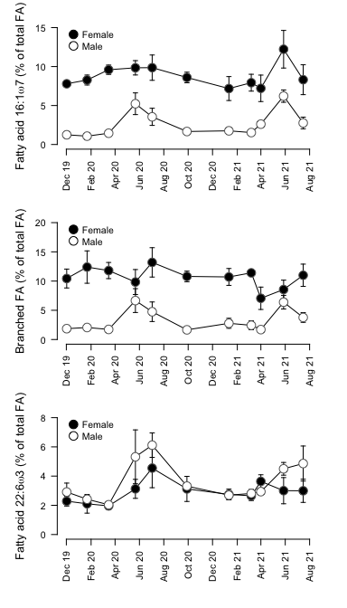
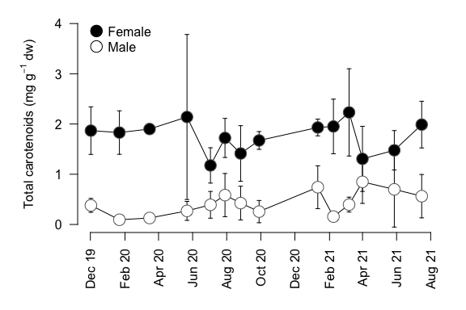
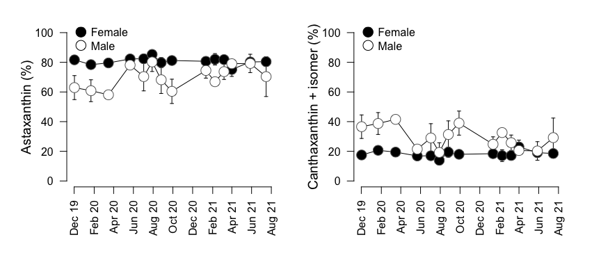

### R Markdown

This R Markdown document is made to support the findings of the paper "Sex-specific seasonal variations in the fatty acid and carotenoid composition of sea cucumber gonads and implications for aquaculture" by David et al. (2023).

Preparing the toolbox
---------------------

Let's begin by loading the libraries that we will require to run the analyses.

``` r
library(agricolae)
library(vegan)
library(ade4)
```

Loading the data
----------------

We load both fatty acid and carotenoids data from the GitHub server. For details on line and column headings please check the readme file.

``` r
FA <- read.csv("https://raw.githubusercontent.com/DAVID-Fk/Sea-cucumber-gonads/main/FA_areas.csv", sep=",", header=T)
pig <- read.csv("https://raw.githubusercontent.com/DAVID-Fk/Sea-cucumber-gonads/main/Pig_conc.csv", sep=",", header=T)
```

Reproductive cycle
==================

Gonad index
-----------

Let's first describe seasonal variations of gonad index

``` r
# Number of individuals per sex
sexPIG <- as.factor(substring(pig[,1], 4, 4))
summary(sexPIG)
```

    ##  F  M 
    ## 61 55

``` r
# Range of individuals weight
range(pig$Idweight)
```

    ## [1]  71.12 223.10

``` r
# Range of gonad weight
range(pig$Gonadwt)
```

    ## [1]  1.22 64.24

``` r
# Gonad index and average gonad index per sampling event
ig <- pig$Gonadwt/pig$Idweight*100

splPIG <- as.POSIXct(pig$splDate, format = "%d/%m/%y")
lvlsplPIG <- as.POSIXct(levels(as.factor(splPIG)), format="%Y-%m-%d")

# Sampling event with highest mean gonad weight
max(tapply(ig, paste(sexPIG, splPIG), mean))
```

    ## [1] 32.9815

``` r
# Sampling event with lowest mean gonad weight
min(tapply(ig, paste(sexPIG, splPIG), mean))
```

    ## [1] 2.232439

``` r
# Significance of gonad weight differences between sampling events in females 
waerden.test(ig[sexPIG=="F"], splPIG[sexPIG=="F"])$statistics
```

    ##      Chisq Df      p.chisq
    ##   42.64812 13 5.128724e-05

``` r
# In males 
waerden.test(ig[sexPIG=="M"], splPIG[sexPIG=="M"])$statistics
```

    ##      Chisq Df      p.chisq
    ##   38.43149 13 0.0002462796

Gonad index visualisation
-------------------------



Fatty acids
===========

Convert FA table to concentrations and relative abundances
----------------------------------------------------------

We assign the value of 0 to fatty acids below detection levels.

``` r
FA[is.na(FA)] <- 0
FAprct <- FA[, -c(1:6, which(colnames(FA)=="C23.0"))]/rowSums(FA[, -c(1:6, which(colnames(FA)=="C23.0"))])*100
rownames(FAprct) <- FA[,1]
head(FAprct[, c(1:7)])
```

    ##             C14.0iso    C14.0 C15.0iso C15.0anteiso    C15.0 C16.0iso    C16.0
    ## GO_F01GL12 1.2004386 4.816183 3.592659     1.491891 1.292780 1.933399 9.793963
    ## GO_F01GL13 0.9987054 6.029221 3.883854     1.313113 1.479564 2.274829 8.618458
    ## GO_F01GL18 1.2962615 4.837498 4.100132     1.559271 1.427766 2.132256 8.251926
    ## GO_F02GL12 1.6473205 5.949816 4.650031     1.709877 1.508306 2.085216 8.737054
    ## GO_F03GL12 1.3978371 4.763000 3.675794     1.357570 1.173493 1.892545 8.053382
    ## GO_F03GL17 1.3971797 6.302448 3.823860     1.410157 1.414482 2.002768 9.261182

``` r
FAconc <- FA[, -c(1:6, which(colnames(FA)=="C23.0"))]/FA$C23.0*FA$StdC23/FA$splMass
rownames(FAconc) <- FA[,1]
head(FAconc[, c(1:6)])
```

    ##             C14.0iso    C14.0 C15.0iso C15.0anteiso     C15.0 C16.0iso
    ## GO_F01GL12 1.3084847 5.249666 3.916018    1.6261697 1.4091374 2.107415
    ## GO_F01GL13 0.6556780 3.958352 2.549859    0.8620951 0.9713748 1.493489
    ## GO_F01GL18 0.7657095 2.857539 2.421973    0.9210709 0.8433902 1.259537
    ## GO_F02GL12 1.2193867 4.404198 3.442066    1.2656925 1.1164849 1.543527
    ## GO_F03GL12 0.9818182 3.345455 2.581818    0.9535354 0.8242424 1.329293
    ## GO_F03GL17 0.9951245 4.488843 2.723499    1.0043671 1.0074480 1.426448

Total fatty acids description
-----------------------------

We will begin with the description of seasonal variations of total fatty acids

``` r
# Total sum of fatty acids
totFA=rowSums(FAconc)

# Factors (sex and sampling event)
sexFA <- as.factor(substring(FA[,1], 4, 4))
splFA <- as.POSIXct(FA$splDate, format = "%d/%m/%y")
lvlsplFA <- as.POSIXct(levels(as.factor(splFA)), format="%Y-%m-%d")

# Mean of total FA per sex
by(totFA, sexFA, mean)
```

    ## sexFA: F
    ## [1] 72.43366
    ## ------------------------------------------------------------ 
    ## sexFA: M
    ## [1] 36.89894

``` r
# Standard deviation of total FA per sex 
by(totFA, sexFA, sd)
```

    ## sexFA: F
    ## [1] 15.73603
    ## ------------------------------------------------------------ 
    ## sexFA: M
    ## [1] 7.875067

``` r
# Sampling event with highest total FA concentration
max(tapply(totFA, paste(sexFA, splFA), mean))
```

    ## [1] 90.52121

``` r
# Sampling event with lowest total FA concentration
min(tapply(totFA, paste(sexFA, splFA), mean))
```

    ## [1] 23.3665

``` r
# Sexual comparison of total FA concentration 
t.test(totFA~sexFA)
```

    ## 
    ##  Welch Two Sample t-test
    ## 
    ## data:  totFA by sexFA
    ## t = 14.088, df = 74.027, p-value < 2.2e-16
    ## alternative hypothesis: true difference in means between group F and group M is not equal to 0
    ## 95 percent confidence interval:
    ##  30.50899 40.56045
    ## sample estimates:
    ## mean in group F mean in group M 
    ##        72.43366        36.89894

``` r
# Significance of total FA concentration differences between sampling events in females 
waerden.test(totFA[sexFA=="F"], splFA[sexFA=="F"])$statistics
```

    ##      Chisq Df     p.chisq
    ##   27.70815 10 0.002009942

``` r
# Let's see if removing the extreme point (April 2021) changes the result of the test
waerden.test(totFA[sexFA=="F"&splFA!="2021-04-01 CEST"], splFA[sexFA=="F"&splFA!="2021-04-01 CEST"])$statistics
```

    ##      Chisq Df    p.chisq
    ##   18.10627  9 0.03396041

``` r
# In males
waerden.test(totFA[sexFA=="M"], splFA[sexFA=="M"])$statistics
```

    ##      Chisq Df   p.chisq
    ##   15.41114 10 0.1177758

Total fatty acids visualisation
-------------------------------



Permutational analysis of variance on fatty acids assemblages
-------------------------------------------------------------

Let's first verify if variances are homogenous

``` r
FAvar=betadisper(vegdist(FAprct), paste(sexFA, as.factor(splFA)))
```

    ## Warning in betadisper(vegdist(FAprct), paste(sexFA, as.factor(splFA))): some
    ## squared distances are negative and changed to zero

``` r
permutest(FAvar)
```

    ## 
    ## Permutation test for homogeneity of multivariate dispersions
    ## Permutation: free
    ## Number of permutations: 999
    ## 
    ## Response: Distances
    ##           Df   Sum Sq    Mean Sq      F N.Perm Pr(>F)  
    ## Groups    21 0.017510 0.00083383 1.5314    999  0.091 .
    ## Residuals 72 0.039203 0.00054449                       
    ## ---
    ## Signif. codes:  0 '***' 0.001 '**' 0.01 '*' 0.05 '.' 0.1 ' ' 1

Let's check if there are significant differences in fatty acid profiles between sampling events.

``` r
adonis2(FAprct~sexFA*as.factor(splFA), method="bray")
```

    ## Permutation test for adonis under reduced model
    ## Terms added sequentially (first to last)
    ## Permutation: free
    ## Number of permutations: 999
    ## 
    ## adonis2(formula = FAprct ~ sexFA * as.factor(splFA), method = "bray")
    ##                        Df SumOfSqs      R2        F Pr(>F)    
    ## sexFA                   1  1.41500 0.65014 388.1570  0.001 ***
    ## as.factor(splFA)       10  0.35128 0.16140   9.6362  0.001 ***
    ## sexFA:as.factor(splFA) 10  0.14771 0.06787   4.0520  0.001 ***
    ## Residual               72  0.26247 0.12060                    
    ## Total                  93  2.17647 1.00000                    
    ## ---
    ## Signif. codes:  0 '***' 0.001 '**' 0.01 '*' 0.05 '.' 0.1 ' ' 1

As the interaction term is significant both sexes will be considered separately.

``` r
adonis2(FAprct[which(sexFA=="F"),]~as.factor(splFA[which(sexFA=="F")]), method="bray")
```

    ## Permutation test for adonis under reduced model
    ## Terms added sequentially (first to last)
    ## Permutation: free
    ## Number of permutations: 999
    ## 
    ## adonis2(formula = FAprct[which(sexFA == "F"), ] ~ as.factor(splFA[which(sexFA == "F")]), method = "bray")
    ##                                       Df SumOfSqs      R2      F Pr(>F)    
    ## as.factor(splFA[which(sexFA == "F")]) 10  0.18553 0.53706 4.5244  0.001 ***
    ## Residual                              39  0.15992 0.46294                  
    ## Total                                 49  0.34545 1.00000                  
    ## ---
    ## Signif. codes:  0 '***' 0.001 '**' 0.01 '*' 0.05 '.' 0.1 ' ' 1

``` r
adonis2(FAprct[which(sexFA=="M"),]~as.factor(splFA[which(sexFA=="M")]), method="bray")
```

    ## Permutation test for adonis under reduced model
    ## Terms added sequentially (first to last)
    ## Permutation: free
    ## Number of permutations: 999
    ## 
    ## adonis2(formula = FAprct[which(sexFA == "M"), ] ~ as.factor(splFA[which(sexFA == "M")]), method = "bray")
    ##                                       Df SumOfSqs     R2      F Pr(>F)    
    ## as.factor(splFA[which(sexFA == "M")]) 10  0.31347 0.7535 10.087  0.001 ***
    ## Residual                              33  0.10255 0.2465                  
    ## Total                                 43  0.41601 1.0000                  
    ## ---
    ## Signif. codes:  0 '***' 0.001 '**' 0.01 '*' 0.05 '.' 0.1 ' ' 1

Hierarchical clustering
-----------------------

We will cluster gonads into groups

``` r
# Calculation of Bray-Curtis distance matrix based on relative FA abundances
d.fau=vegdist(FAprct, method="bray")

# Calculation of a dendrogram using the Ward method
dendro.fau=hclust(d.fau, method="ward.D")

plot(dendro.fau, cex=0.2)
```



``` r
#A classification into three groups seems appropriate 
cut=cutree(dendro.fau, k=3)
```

Visual representation of Principal Correspondance Analysis on FA assemblages
----------------------------------------------------------------------------



Note that the figure was further modified with a vectorial graphics editor to avoid labels superposition

Summary table
-------------

``` r
# Sums of fatty acids

brFA=rowSums(FAprct[, c(which(colnames(FAprct)=="C14.0iso"), which(colnames(FAprct)=="C15.0iso"), which(colnames(FAprct)=="C15.0anteiso"), which(colnames(FAprct)=="C16.0iso"), which(colnames(FAprct)=="C17.0iso"), which(colnames(FAprct)=="C17.0anteiso"))])
SFA=rowSums(FAprct[, c(which(colnames(FAprct)=="C14.0"), which(colnames(FAprct)=="C15.0"), which(colnames(FAprct)=="C16.0"), which(colnames(FAprct)=="C17.0"), which(colnames(FAprct)=="C18.0"), which(colnames(FAprct)=="C19.0"),which(colnames(FAprct)=="C20.0"), which(colnames(FAprct)=="C21.0"), which(colnames(FAprct)=="C22.0"))])
PUFA=rowSums(FAprct[, c(which(colnames(FAprct)=="C18.2w6"), which(colnames(FAprct)=="C18.3w3"), which(colnames(FAprct)=="C18.4w3"), which(colnames(FAprct)=="C20.2w6"), which(colnames(FAprct)=="C20.4w6"), which(colnames(FAprct)=="C20.3w6"),which(colnames(FAprct)=="C20.4w3"), which(colnames(FAprct)=="C20.5w3"), which(colnames(FAprct)=="C22.5w6"), which(colnames(FAprct)=="C22.6w3"))])
w3=rowSums(FAprct[, c(which(colnames(FAprct)=="C18.3w3"), which(colnames(FAprct)=="C18.4w3"), which(colnames(FAprct)=="C20.4w3"), which(colnames(FAprct)=="C20.5w3"), which(colnames(FAprct)=="C22.6w3"))])
w6=rowSums(FAprct[, c(which(colnames(FAprct)=="C18.2w6"), which(colnames(FAprct)=="C20.2w6"), which(colnames(FAprct)=="C20.4w6"), which(colnames(FAprct)=="C20.3w6"), which(colnames(FAprct)=="C22.5w6"))])
LCMUFA=rowSums(FAprct[, c(which(colnames(FAprct)=="C20.1w9"), which(colnames(FAprct)=="C20.1w7"), which(colnames(FAprct)=="C22.1w9"), which(colnames(FAprct)=="C23.1w9"), which(colnames(FAprct)=="C24.1w9"))])
MUFA=rowSums(FAprct[, c(which(colnames(FAprct)=="C16.1w7"), which(colnames(FAprct)=="C18.1w9"), which(colnames(FAprct)=="C18.1w7"), which(colnames(FAprct)=="C20.1w9"), which(colnames(FAprct)=="C20.1w7"), which(colnames(FAprct)=="C22.1w9"), which(colnames(FAprct)=="C23.1w9"), which(colnames(FAprct)=="C24.1w9"))])
HUFA=rowSums(FAprct[, c(which(colnames(FAprct)=="C20.4w6"), which(colnames(FAprct)=="C20.3w6"),which(colnames(FAprct)=="C20.4w3"), which(colnames(FAprct)=="C20.5w3"), which(colnames(FAprct)=="C22.5w6"), which(colnames(FAprct)=="C22.6w3"))])

prfull=cbind(FAprct, brFA, PUFA, SFA, MUFA, LCMUFA, w3, w6, HUFA, totFA)
moyAG=data.frame(M=aggregate(prfull, by=list(cut), mean), SD=aggregate(prfull, by=list(cut),sd))

head(t(moyAG))
```

    ##                    [,1]      [,2]       [,3]
    ## M.Group.1      1.000000 2.0000000 3.00000000
    ## M.C14.0iso     1.290163 0.5057761 0.06644387
    ## M.C14.0        5.481193 2.6626359 0.75367521
    ## M.C15.0iso     3.892608 1.9183734 0.61770342
    ## M.C15.0anteiso 1.446844 0.6615470 0.11634275
    ## M.C15.0        1.378976 0.7651920 0.25442934

Significant changes in especially time-responsive FA
----------------------------------------------------

``` r
# Significance of 16:1w7 variations over time in females 
waerden.test(FAprct[, which(colnames(FAprct)=="C16.1w7")][sexFA=="F"], splFA[sexFA=="F"])$statistics
```

    ##      Chisq Df     p.chisq
    ##   27.29391 10 0.002339471

``` r
# Significance of 16:1w7 variations over time in males 
waerden.test(FAprct[, which(colnames(FAprct)=="C16.1w7")][sexFA=="M"], splFA[sexFA=="M"])$statistics
```

    ##     Chisq Df      p.chisq
    ##   35.1596 10 0.0001172709

``` r
# Significance of branched FA variations over time in females 
waerden.test(brFA[sexFA=="F"], splFA[sexFA=="F"])$statistics
```

    ##     Chisq Df    p.chisq
    ##   24.2938 10 0.00685761

``` r
# Significance of branched FA variations over time in males 
waerden.test(brFA[sexFA=="M"], splFA[sexFA=="M"])$statistics
```

    ##      Chisq Df      p.chisq
    ##   31.86498 10 0.0004217168

``` r
# Significance of 22:6w3 variations over time in females 
waerden.test(FAprct[, which(colnames(FAprct)=="C22.6w3")][sexFA=="F"], splFA[sexFA=="F"])$statistics
```

    ##      Chisq Df      p.chisq
    ##   29.68241 10 0.0009653009

``` r
# Significance of 22:6w3 variations over time in males 
waerden.test(FAprct[, which(colnames(FAprct)=="C22.6w3")][sexFA=="M"], splFA[sexFA=="M"])$statistics
```

    ##      Chisq Df      p.chisq
    ##   33.19646 10 0.0002524316

Graphical visualisation of especially time-responsive FA
--------------------------------------------------------



Carotenoids
===========

Total carotenoids description
-----------------------------

``` r
# Total sum of carotenoids
totPIG=apply(pig[, -c(1:5)],1,sum)

# Sexual comparison of total pigments concentration 
t.test(totPIG~sexPIG)
```

    ## 
    ##  Welch Two Sample t-test
    ## 
    ## data:  totPIG by sexPIG
    ## t = 13.17, df = 97.691, p-value < 2.2e-16
    ## alternative hypothesis: true difference in means between group F and group M is not equal to 0
    ## 95 percent confidence interval:
    ##  1.117734 1.514359
    ## sample estimates:
    ## mean in group F mean in group M 
    ##       1.7730011       0.4569545

``` r
# Significance of total pigments concentration differences between sampling events in females 
waerden.test(totPIG[sexPIG=="F"], splPIG[sexPIG=="F"])$statistics
```

    ##      Chisq Df   p.chisq
    ##   18.36775 13 0.1440487

``` r
# In males
waerden.test(totPIG[sexPIG=="M"], splPIG[sexPIG=="M"])$statistics
```

    ##      Chisq Df  p.chisq
    ##   17.20256 13 0.190209

Total carotenoids visualisation
-------------------------------



Convert table to relative abundances (%)
----------------------------------------

``` r
PIGprct <-pig[, -c(1:5)]/rowSums(pig[, -c(1:5)])*100
rownames(PIGprct) <- pig[,1]
head(PIGprct)
```

    ##                Cant1 Canthaxanthin     Echi1 Echinenone Astaxanthin
    ## GO_F01_GL12 3.912978      14.92439 0.4552332  0.3772876    80.33011
    ## GO_F01_GL13 4.606107      15.07756 0.2323710  0.2678332    79.81612
    ## GO_F01_GL18 4.441548      14.01515 0.3450101  0.3297318    80.86856
    ## GO_F01_GL19 4.755388      14.16280 0.4436790  0.2437262    80.39440
    ## GO_F01_GL22 3.803644      17.25185 0.4941566  0.4046920    78.04566
    ## GO_F02_GL12 4.205364      15.45455 0.3591382  0.3974252    79.58352

Permutational analysis of variance on carotenoid assemblages
------------------------------------------------------------

Let's first verify if variances are homogeneous

``` r
PIGvar=betadisper(vegdist(PIGprct), paste(sexPIG, as.factor(splPIG)))
```

    ## Warning in betadisper(vegdist(PIGprct), paste(sexPIG, as.factor(splPIG))): some
    ## squared distances are negative and changed to zero

``` r
permutest(PIGvar)
```

    ## 
    ## Permutation test for homogeneity of multivariate dispersions
    ## Permutation: free
    ## Number of permutations: 999
    ## 
    ## Response: Distances
    ##           Df   Sum Sq   Mean Sq      F N.Perm Pr(>F)  
    ## Groups    27 0.056365 0.0020876 1.4521    999  0.098 .
    ## Residuals 88 0.126510 0.0014376                       
    ## ---
    ## Signif. codes:  0 '***' 0.001 '**' 0.01 '*' 0.05 '.' 0.1 ' ' 1

Let's check if there are significant differences in carotenoid profiles between sampling events.

``` r
adonis2(PIGprct~sexPIG*as.factor(splPIG), method="bray")
```

    ## Permutation test for adonis under reduced model
    ## Terms added sequentially (first to last)
    ## Permutation: free
    ## Number of permutations: 999
    ## 
    ## adonis2(formula = PIGprct ~ sexPIG * as.factor(splPIG), method = "bray")
    ##                           Df SumOfSqs      R2       F Pr(>F)    
    ## sexPIG                     1  0.30386 0.33750 87.1319  0.001 ***
    ## as.factor(splPIG)         13  0.16107 0.17890  3.5527  0.001 ***
    ## sexPIG:as.factor(splPIG)  13  0.12852 0.14275  2.8349  0.003 ** 
    ## Residual                  88  0.30689 0.34086                   
    ## Total                    115  0.90034 1.00000                   
    ## ---
    ## Signif. codes:  0 '***' 0.001 '**' 0.01 '*' 0.05 '.' 0.1 ' ' 1

``` r
adonis2(pig[, -c(1:5)]~sexPIG*as.factor(splPIG), method="bray")
```

    ## Permutation test for adonis under reduced model
    ## Terms added sequentially (first to last)
    ## Permutation: free
    ## Number of permutations: 999
    ## 
    ## adonis2(formula = pig[, -c(1:5)] ~ sexPIG * as.factor(splPIG), method = "bray")
    ##                           Df SumOfSqs      R2        F Pr(>F)    
    ## sexPIG                     1   8.2904 0.49348 122.0428  0.001 ***
    ## as.factor(splPIG)         13   1.1626 0.06920   1.3165  0.160    
    ## sexPIG:as.factor(splPIG)  13   1.3689 0.08149   1.5502  0.047 *  
    ## Residual                  88   5.9779 0.35583                    
    ## Total                    115  16.7999 1.00000                    
    ## ---
    ## Signif. codes:  0 '***' 0.001 '**' 0.01 '*' 0.05 '.' 0.1 ' ' 1

As the interaction term is significant both sexes will be considered separately.

``` r
adonis2(PIGprct[sexPIG=="F",]~as.factor(splPIG)[sexPIG=="F"], method="bray")
```

    ## Permutation test for adonis under reduced model
    ## Terms added sequentially (first to last)
    ## Permutation: free
    ## Number of permutations: 999
    ## 
    ## adonis2(formula = PIGprct[sexPIG == "F", ] ~ as.factor(splPIG)[sexPIG == "F"], method = "bray")
    ##                                  Df SumOfSqs     R2      F Pr(>F)  
    ## as.factor(splPIG)[sexPIG == "F"] 13 0.024563 0.3758 2.1766  0.025 *
    ## Residual                         47 0.040800 0.6242                
    ## Total                            60 0.065363 1.0000                
    ## ---
    ## Signif. codes:  0 '***' 0.001 '**' 0.01 '*' 0.05 '.' 0.1 ' ' 1

``` r
adonis2(PIGprct[sexPIG=="M",]~as.factor(splPIG)[sexPIG=="M"], method="bray")
```

    ## Permutation test for adonis under reduced model
    ## Terms added sequentially (first to last)
    ## Permutation: free
    ## Number of permutations: 999
    ## 
    ## adonis2(formula = PIGprct[sexPIG == "M", ] ~ as.factor(splPIG)[sexPIG == "M"], method = "bray")
    ##                                  Df SumOfSqs    R2      F Pr(>F)   
    ## as.factor(splPIG)[sexPIG == "M"] 13  0.26502 0.499 3.1412  0.002 **
    ## Residual                         41  0.26609 0.501                 
    ## Total                            54  0.53111 1.000                 
    ## ---
    ## Signif. codes:  0 '***' 0.001 '**' 0.01 '*' 0.05 '.' 0.1 ' ' 1

Summary table
-------------

``` r
moyPig=data.frame(M=aggregate(cbind(PIGprct, totPIG), by=list(sexPIG), mean), SD=aggregate(cbind(PIGprct, totPIG), by=list(sexPIG),sd), le=aggregate(cbind(PIGprct, totPIG), by=list(sexPIG),length))

t(moyPig)
```

    ##                  [,1]         [,2]        
    ## M.Group.1        "F"          "M"         
    ## M.Cant1          "4.137059"   "5.805644"  
    ## M.Canthaxanthin  "14.16871"   "22.81248"  
    ## M.Echi1          "0.4721317"  "0.2463885" 
    ## M.Echinenone     "0.4580230"  "0.2814552" 
    ## M.Astaxanthin    "80.76407"   "70.85403"  
    ## M.totPIG         "1.7730011"  "0.4569545" 
    ## SD.Group.1       "F"          "M"         
    ## SD.Cant1         "0.849205"   "2.260141"  
    ## SD.Canthaxanthin "2.398863"   "7.828401"  
    ## SD.Echi1         "0.23865549" "0.09887887"
    ## SD.Echinenone    "0.2074604"  "0.1156214" 
    ## SD.Astaxanthin   "3.186706"   "9.837141"  
    ## SD.totPIG        "0.6669796"  "0.3848485" 
    ## le.Group.1       "F"          "M"         
    ## le.Cant1         "61"         "55"        
    ## le.Canthaxanthin "61"         "55"        
    ## le.Echi1         "61"         "55"        
    ## le.Echinenone    "61"         "55"        
    ## le.Astaxanthin   "61"         "55"        
    ## le.totPIG        "61"         "55"

Temporal changes in the relative abundance of astaxanthin and canthaxanthins
----------------------------------------------------------------------------

Let's describe the range of variations in the relative abundance of astaxanthin for each sex

``` r
range(PIGprct[sexPIG=="M", "Astaxanthin"])
```

    ## [1] 47.23066 86.49813

``` r
range(PIGprct[sexPIG=="F", "Astaxanthin"])
```

    ## [1] 70.04523 86.60448

Let's check if there are significant differences between proportions of Astaxanthin in males and in females in late spring/early summer (from May to August) and the rest of the year

``` r
summerAstaM=split(PIGprct[sexPIG=="M", "Astaxanthin"], as.numeric(substring(pig$splDate[sexPIG=="M"], 4, 5))>4&as.numeric(substring(pig$splDate[sexPIG=="M"], 4, 5))<9)

t.test(as.double(unlist(summerAstaM[1])), as.double(unlist(summerAstaM[2])))
```

    ## 
    ##  Welch Two Sample t-test
    ## 
    ## data:  as.double(unlist(summerAstaM[1])) and as.double(unlist(summerAstaM[2]))
    ## t = -2.6719, df = 52.999, p-value = 0.009998
    ## alternative hypothesis: true difference in means is not equal to 0
    ## 95 percent confidence interval:
    ##  -11.752783  -1.673758
    ## sample estimates:
    ## mean of x mean of y 
    ##  67.43636  74.14963

``` r
summerAstaF=split(PIGprct[sexPIG=="F", "Astaxanthin"], as.numeric(substring(pig$splDate[sexPIG=="F"], 4, 5))>4&as.numeric(substring(pig$splDate[sexPIG=="F"], 4, 5))<9)

t.test(as.double(unlist(summerAstaF[1])), as.double(unlist(summerAstaF[2])))
```

    ## 
    ##  Welch Two Sample t-test
    ## 
    ## data:  as.double(unlist(summerAstaF[1])) and as.double(unlist(summerAstaF[2]))
    ## t = -1.4478, df = 55.111, p-value = 0.1533
    ## alternative hypothesis: true difference in means is not equal to 0
    ## 95 percent confidence interval:
    ##  -2.7844963  0.4486246
    ## sample estimates:
    ## mean of x mean of y 
    ##  80.28541  81.45335


